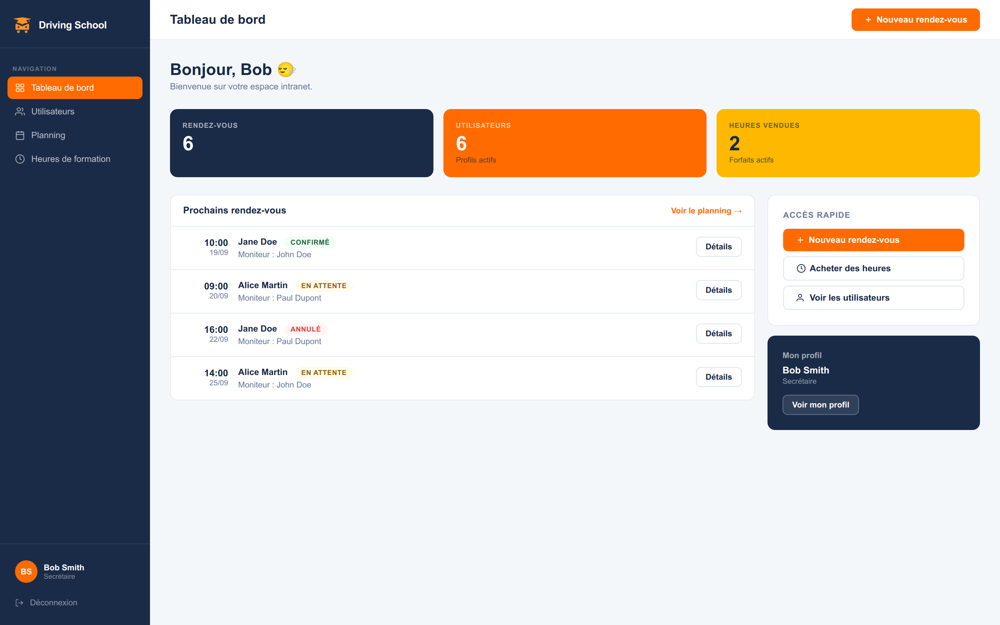

# Driving School — intranet d'auto-école



<p align="center">
  
  
  
  
</p>

🌐 **Démo en ligne : [driving-school.leaballester.com](https://driving-school.leaballester.com)**

Intranet de gestion pour une auto-école : comptes, planning des leçons et suivi des heures de
formation, avec quatre rôles aux droits distincts. Projet Epitech réalisé à deux, repris et mis
en production.

> Site de démonstration : les identifiants des quatre comptes sont affichés sur la page de
> connexion, et les données sont remises à zéro chaque nuit.

## Fonctionnalités

- **Quatre rôles** — apprenant, moniteur, secrétaire, admin — chacun ne voit et ne fait que ce
  qui lui revient, vérifié côté serveur
- **Comptes** : création, modification, suppression, avec des rôles attribuables limités selon
  qui agit (seul l'admin gère les comptes secrétaire)
- **Planning** : rendez-vous entre un apprenant et un moniteur, avec statut (en attente,
  confirmé, annulé). Un moniteur ne gère que ses propres créneaux
- **Heures de formation** : solde par apprenant, crédité par le secrétariat. Un rendez-vous
  confirmé réserve sa durée sur le solde ; annulé ou supprimé, il la rend

## Stack

| Couche     | Techno                                        |
| ---------- | --------------------------------------------- |
| Back       | Django 6.1, Python 3.12+                      |
| Front      | Templates Django, CSS sans framework          |
| Base       | SQLite                                        |
| Production | nginx + gunicorn, Let's Encrypt, Cloudflare   |

## Sommaire

1. [Comptes de démonstration](#comptes-de-démonstration)
2. [Installation](#installation)
3. [Configuration](#configuration)
4. [Commandes utiles](#commandes-utiles)
5. [Déploiement](#déploiement)
6. [Pistes d'amélioration](#pistes-damélioration)
7. [Collaborateurs](#collaborateurs)

---

## Comptes de démonstration

| Rôle | Identifiant | Mot de passe | Ce qu'il permet de tester |
|---|---|---|---|
| Apprenant | `Jane_Apprenant` | `apprenant123` | son planning, son solde, sa fiche |
| Moniteur | `John_Moniteur` | `moniteur123` | ses élèves, création et suivi de ses rendez-vous |
| Secrétaire | `Bob_Secretaire` | `secretaire123` | comptes apprenant/moniteur, heures, tous les rendez-vous |
| Admin | `Claire_Admin` | `admin123` | tout, y compris les comptes secrétaire |

Les comptes de démonstration ne peuvent pas être modifiés ni supprimés ; tout ce que les
visiteurs créent est effacé chaque nuit.

## Installation

Prérequis : Python ≥ 3.12.

```bash
git clone git@github.com:YetAnotherLea/Driving-School.git
cd Driving-School
python3 -m venv venv && source venv/bin/activate
pip install -r requirements.txt
cp .env.example .env            # DJANGO_DEBUG=1 suffit en local

cd app
python manage.py migrate
python manage.py seed_demo      # comptes et rendez-vous de démonstration
python manage.py runserver
```

Puis http://127.0.0.1:8000/ — les comptes de démonstration sont sur la page de connexion.

## Configuration

Tout se règle par variables d'environnement, lues dans `.env` à la racine en local et fournies
par systemd en production. Voir [`.env.example`](.env.example).

| Variable | Rôle | Défaut |
| --- | --- | --- |
| `DJANGO_DEBUG` | `1` en développement, jamais en production | `0` |
| `DJANGO_SECRET_KEY` | obligatoire hors debug | — |
| `DJANGO_ALLOWED_HOSTS` | hôtes acceptés, séparés par des virgules | `127.0.0.1,localhost` |
| `DJANGO_DB_PATH` | chemin de la base SQLite | `app/db.sqlite3` |

## Commandes utiles

```bash
python manage.py test                 # 43 tests, dont les droits de chaque rôle
python manage.py seed_demo            # crée ou remet en état les données de démo
python manage.py seed_demo --reset    # efface aussi tout ce qui n'est pas de la démo
python manage.py check --deploy       # contrôle de la configuration de production
```

## Déploiement

Le site tourne sur un VPS derrière nginx, servi par gunicorn sur un socket Unix, en HTTPS.
Séquence de mise à jour après un `git pull` :

```bash
pip install -r requirements.txt
python app/manage.py collectstatic --noinput
python app/manage.py migrate --noinput
python app/manage.py seed_demo
systemctl restart driving-school
```

Points d'attention :

- hors debug, le serveur refuse de démarrer sans `DJANGO_SECRET_KEY`
- `DJANGO_DB_PATH` doit pointer hors de l'arbre déployé, pour que la base survive aux mises à jour
- un timer systemd lance `seed_demo --reset` chaque nuit
- le site de démo est volontairement non indexé (`robots.txt`, en-tête `X-Robots-Tag`)

## Pistes d'amélioration

- Historique des leçons effectuées, distinct des rendez-vous confirmés
- Notifications par e-mail à la confirmation ou l'annulation d'un rendez-vous
- Export du planning d'un moniteur
- Déploiement automatisé par GitHub Actions

## Collaborateurs

- **Stefan-Paris Paduraru**
- **Léa Ballester**

_Projet réalisé dans le cadre de la Web Academy Epitech Marseille — Promo 2026_
